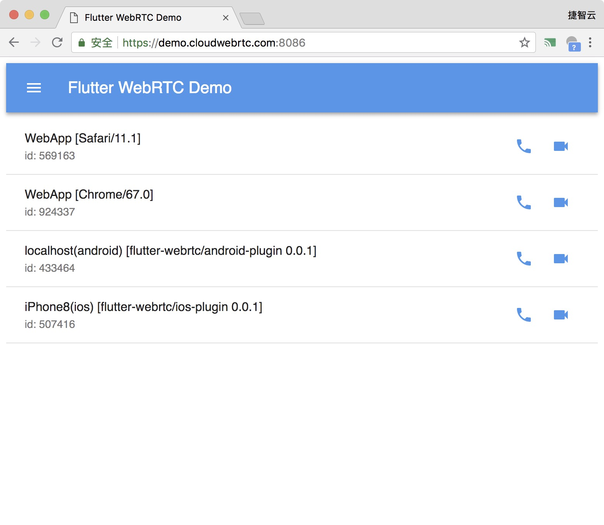
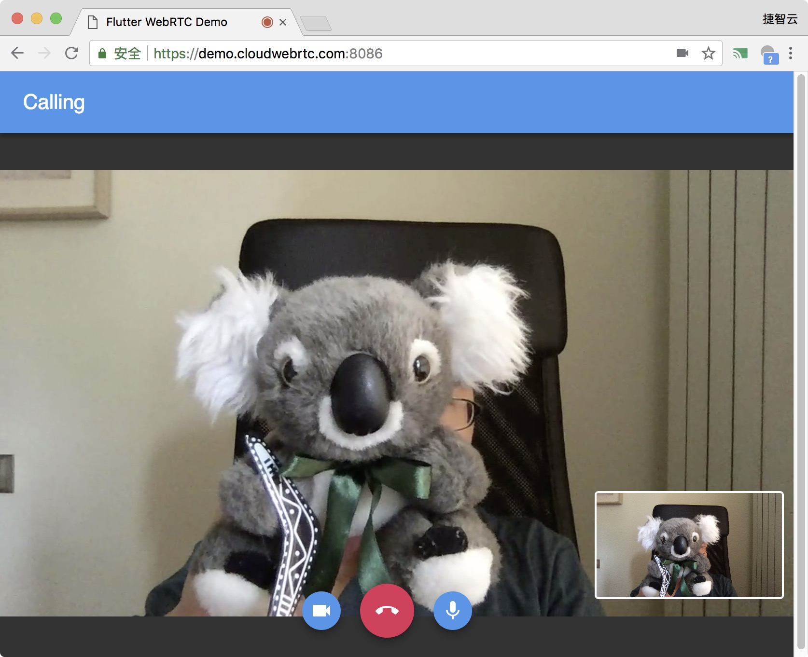

# flutter-webrtc-server
 [](https://join.slack.com/t/flutterwebrtc/shared_invite/zt-q83o7y1s-FExGLWEvtkPKM8ku_F8cEQ)
 
A simple WebRTC Signaling server for flutter-webrtc and html5.

Online Demo: https://demo.cloudwebrtc.com:8086/

## Features
- Support Windows/Linux/macOS
- Built-in web, signaling, [turn server](https://github.com/pion/turn/tree/master/examples/turn-server)
- Support [REST API For Access To TURN Services](https://tools.ietf.org/html/draft-uberti-behave-turn-rest-00)
- Use [flutter-webrtc-demo](https://github.com/cloudwebrtc/flutter-webrtc-demo) for all platforms.

## Usage

### Run from source

- Clone the repository.  

```bash
git clone https://github.com/flutter-webrtc/flutter-webrtc-server.git
cd flutter-webrtc-server
```

- Use `mkcert` to create a self-signed certificate.

```bash
brew update
brew install mkcert
mkcert -key-file configs/certs/key.pem -cert-file configs/certs/cert.pem  localhost 127.0.0.1 ::1 0.0.0.0
```

- Run

```bash
brew install golang
go run cmd/server/main.go
```

- Open https://0.0.0.0:8086 to use flutter web demo.
- If you need to test mobile app, please check the [webrtc-flutter-demo](https://github.com/cloudwebrtc/flutter-webrtc-demo). 

## Note
If you need to use it in a production environment, you need more testing.

## screenshots
# iOS/Android
   

# PC/HTML5
 
